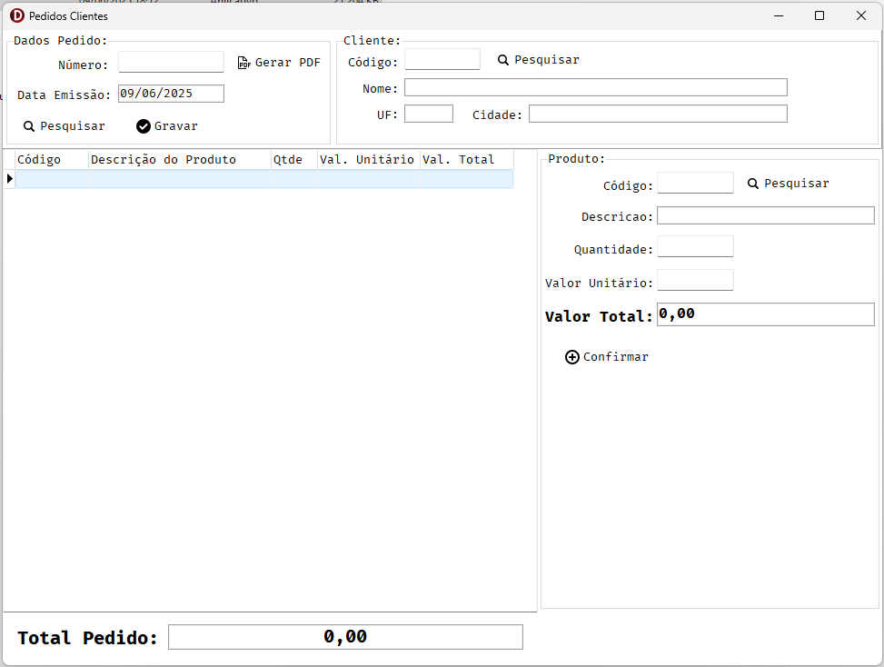
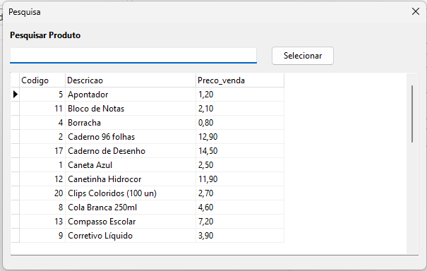

# Projeto Teste Técnico Delphi - Sistema de Pedidos

Este é um projeto de avaliação desenvolvido em Delphi (Athens 12).  
O sistema realiza o gerenciamento de **Pedidos**, **Clientes** e **Produtos**, com controle de itens do pedido, pesquisa dinâmica e exportação de pedido.

## 🖥️ Funcionalidades

- Cadastro, alteração e exclusão de pedidos e seus itens
- Busca de cliente, produto e pedido (por código e via tela de pesquisa)
- Controle de transação no banco de dados (MySQL)
- Leitura e gravação de configuração de conexão via arquivo `.ini`
- Pesquisa genérica reutilizável para clientes, produtos e pedidos (uma única tela para os três)
- Exportação manual do pedido para HTML (visualização, impressão e PDF)
- Validações de campos obrigatórios e consistência dos dados
- Controle de alterações não salvas (avisa ao fechar sem gravar)
- Interface simples, intuitiva e responsiva
- Código estruturado por camadas (DAO, Models, UI)

## 🛠️ Tecnologias Utilizadas

- **Delphi Athens 12** (VCL)
- **MySQL Community**
- **FireDAC** (conexão)
- **Datasnap DBClient / TClientDataSet** (camada intermediária para pesquisa)
- **ShellAPI** (abertura de arquivos exportados)
- **Arquivo INI** para configuração

## 📄 Estrutura de Pastas

ProjetoPedidos/
│
├── config/
│   └── config.ini                  # Configuração da conexão com o banco
│
├── db/
│   └── bd_teste.sql                # Script para criar e popular o banco de dados MySQL
│
├── doc/
│   └── Teste Delphi - 2025.pdf     # Documentação requisitos do projeto
│
├── lib/
│   └── libmysql.dll                # DLL do MySQL usada pela aplicação
│
├── src/
│   ├── Forms
│   │    ├── UFrmPedido.pas              # Tela principal
│   │    ├── UFrmPedido.dfm
│   │    ├── UFrmPesquisaGenerica.pas    # Tela de pesquisa (lookup)
│   │    ├── UFrmPesquisaGenerica.dfm
│   ├── DAO
│   │    ├──  UClienteDAO.pas             # DAO de clientes
│   │    ├──  UProdutoDAO.pas             # DAO de produtos
│   │    ├──  UPedidoDAO.pas              # DAO de pedidos
│   │    ├──  UConexaoDB.pas              # Classe de conexão
│   ├── Models/
│   │    ├── TPedido.pas            # Modelos das entidades
│   │    ├── TProduto.pas
│   │    ├── TCliente.pas
│
├── Win32/
│   └── (gerado pelo Delphi)
│
├── ProjetoPedidos.dpr
├── ProjetoPedidos.dproj
├── ProjetoPedidos.res
├── TelaPesquisa.png
├── TelaPrincipal.png
└── README.md                       # Raiz pode ter um atalho do README

## ⚙️ Configuração

1. Instale o **MySQL Community**.
2. Importe o script SQL `dump_teste.sql` disponível na pasta `db\` para criar as tabelas e dados.
3. Configure o arquivo `config.ini` com os dados da conexão:
    ```ini
    [Conexao]
    Database=teste_pedidos
    Username=root
    Password=1234
    Server=localhost
    Port=3306
    DriverDLL=lib\libmysql.dll
    ```
4. Certifique-se de ter o arquivo `libmysql.dll` na pasta `lib\` do projeto.

## 🚀 Como Executar

1. Abra o projeto no **Delphi 12 Athens**.
2. Compile e execute o projeto.
3. Na primeira execução, verifique a conexão com o banco através da tela de configuração ou config.ini.
4. Utilize os botões de **Pesquisa** para localizar clientes, produtos e pedidos, ou digite o código diretamente.
5. Após lançar os itens no pedido, utilize **Gravar** para salvar, **Cancelar** para descartar alterações, **Excluir** para remover um pedido e **Exportar** para gerar um arquivo HTML do pedido.

## 📝 Observações

- A **tela de pesquisa** é única e reutilizada para **clientes, produtos e pedidos**. Basta mudar o contexto da chamada.
- Ao fechar um pedido sem salvar, o sistema pergunta se deseja gravar antes de sair.
- Os botões “Carregar Pedido” e “Cancelar Pedido” ficam visíveis apenas quando o campo do cliente está em branco, conforme especificação.
- A exportação gera um arquivo HTML, que pode ser aberto no navegador e salvo como PDF ou impresso.
- Todos os acessos a banco são feitos exclusivamente via camada DAO (nenhum SQL no formulário).

## 📷 Prints das Telas

### Tela Principal do Sistema



### Tela de Pesquisa (lookup) — utilizada para Cliente, Produto e Pedido



---

## 🧑‍💻 Desenvolvido por

Kauê Sanches Ferreira  
[LinkedIn](https://www.linkedin.com/in/kaue-sanches/)  
[GitHub](https://github.com/KaueSanchesFerreira)